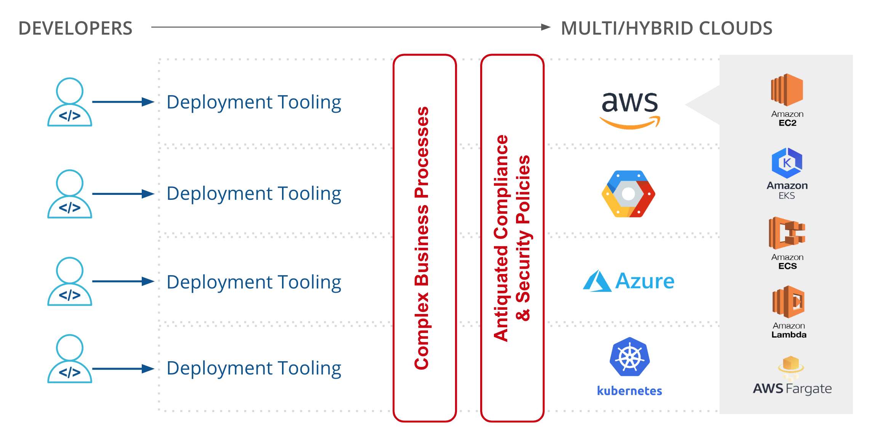

:title: Spinnaker Fundamentals
:author: Thomas A. McGonagle
:keywords: Spinnaker
:skip-help: true
:css: presentation.css

.. header::
    .. image:: images/Armory_logo.gif 
        :height: 300px
        :width: 600px
        :align: center

.. footer::
    .. image:: images/spinnaker.png 
        :height: 75px
        :width: 90px
        :align: center
    

----

:id: title-slide

Spinnaker Fundamentals 
======================
*Customer Name*
---------------
9/11/19
-------

.. note::

  * note

----

:id: who-am-i

whoami?
=======
Thomas A. McGonagle
-------------------
Solutions Architect
-------------------
thomas.mcgonagle@armory.io
--------------------------
@mcgonagle
----------

.. note::
  * note

----

:id: spinnaker-metaphor

Spinnaker Metaphor
========================

.. note::
  * note

----

:id: class-intro

Class Introductions
===================

* Name

* Role

* Experience with DevOps

* Super Power of Choice

.. note::

  * note

----

:id: training-goals

Training Goals
==============

* Grok Spinnaker

* ??

.. image:: images/grok.png
    :height: 300px
    :width: 900px
    :align: right

.. note::

  * note

----

:id: training-philosophy

Training Philosophy
===================

.. image:: images/grampy.png 
    :height: 175px
    :width: 250px
    :align: left

----

:id: devops-definition

DevOps Definition
=================

Technical and Cultural focus on Teamwork and the software delivery Mission 
--------------------------------------------------------------------------

.. note::

    * note

----

:id: devops-tenants

DevOps Tenants - ACAMS+
=======================

* Agile
* Culture
* Automation
* Metrics
* Sharing
* Plus...

.. note::

    * note

----

:id: devops-practices

DevOps Practices
=======================

.. image:: images/devops_playbook.png 
    :height: 800px
    :width: 1500px
    :align: right

.. note::

    * note

----

:id: migrating-to-the-cloud

Migrating to the Cloud
======================

.. note::

    * note

----

:id: conclusions

Conclusions
===========

----

:id: questions

Questions?
==========

Presentation available at: https://github.com/armory-training/101
